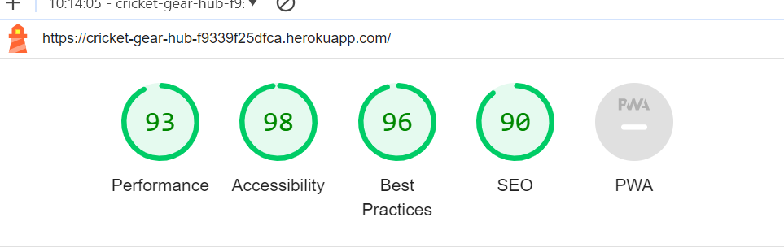
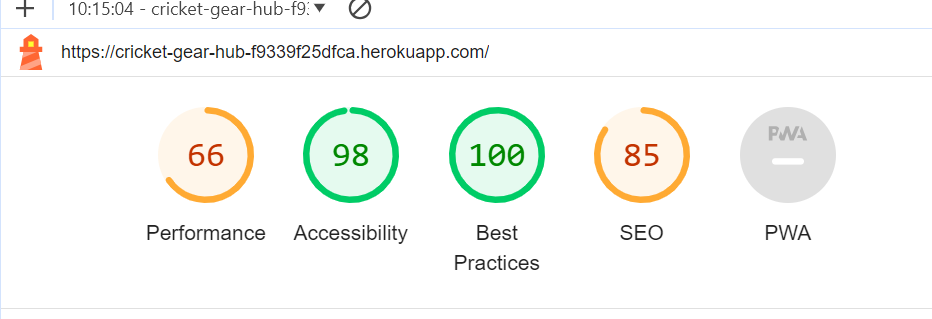
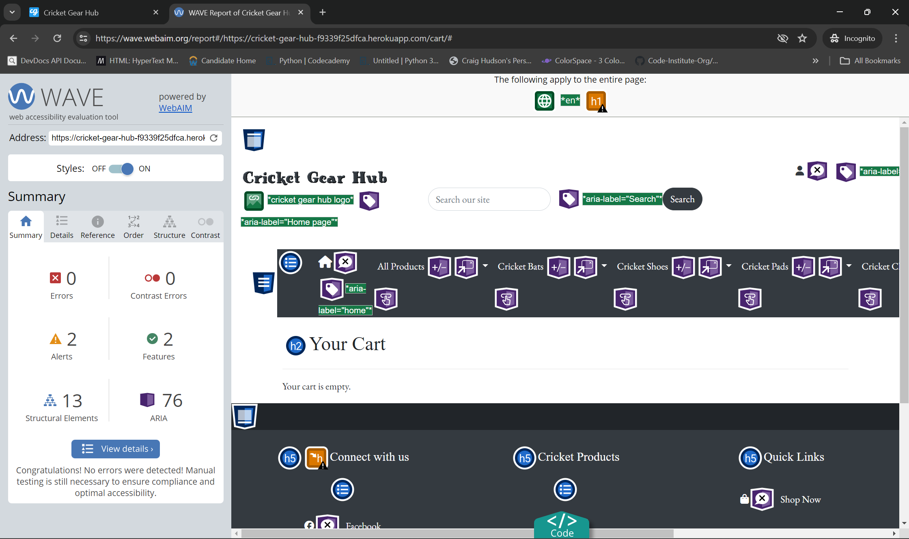
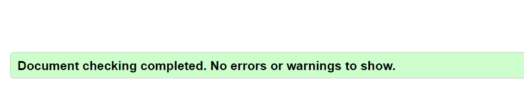
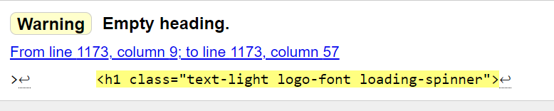
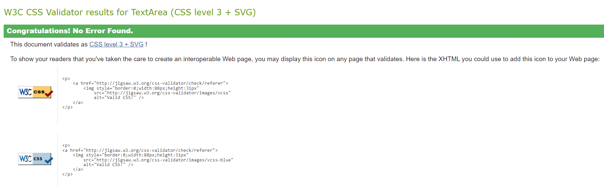
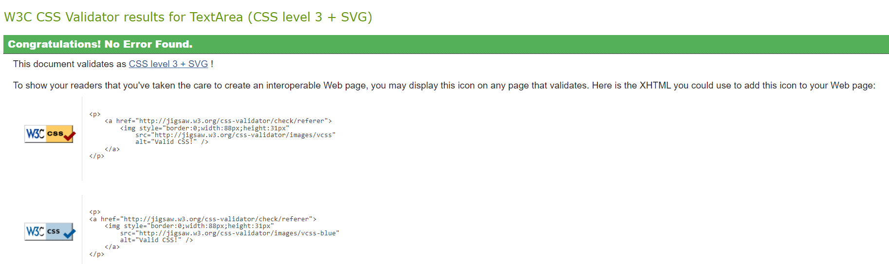
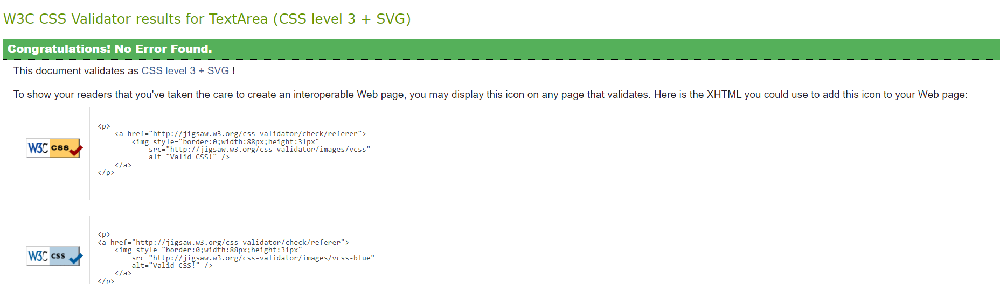
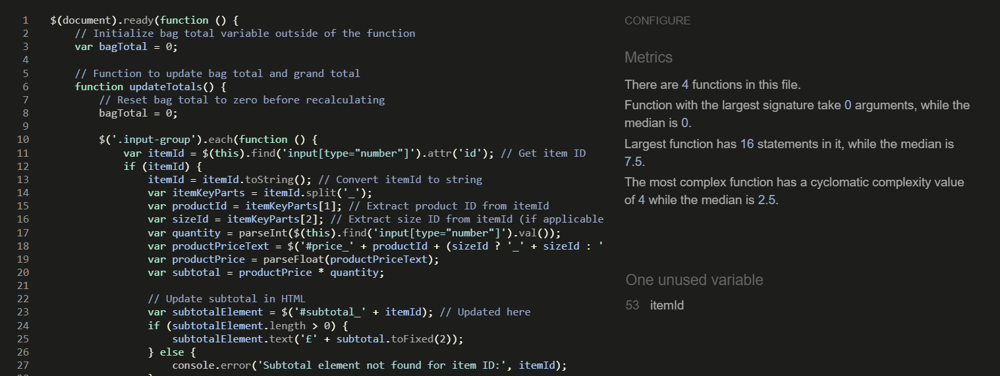
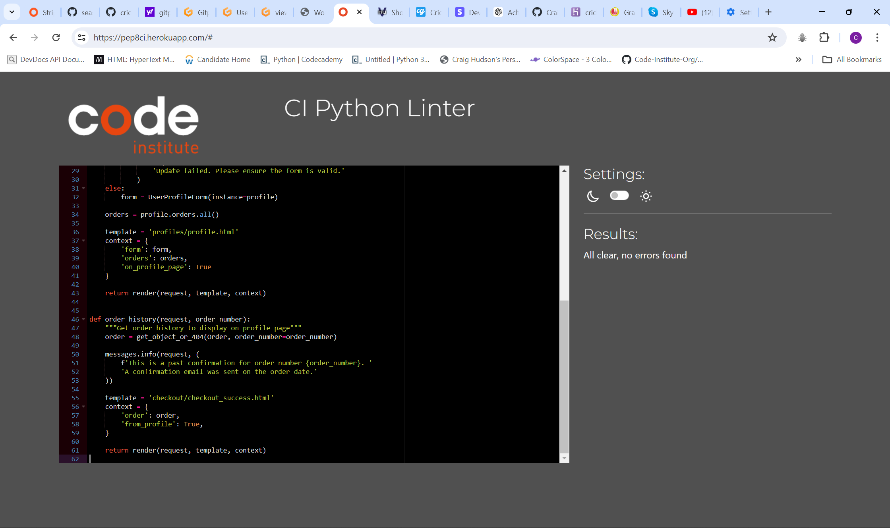

# Readers Realm Testing

## Table of Contents

- [Cricket Gear Hub Testing](#cricket-gear-hub-testing)
  - [Table of Contents](#table-of-contents)
  - [Overview](#overview)
  - [Automated Testing](#automated-testing)
    - [Lighthouse](#lighthouse)
    - [HTML Validator](#html-validator)
    - [CSS Validator](#css-validator)
    - [JavaScript Validator](#javascript-validator)
  - [Wave Reports](#wave-reports)
  - [Manual Testing](#manual-testing)
    - [Testing User Stories](#testing-user-stories)
    - [Full Testing](#full-testing)

## Overview

Just a quick overview on what I've tested and how I've gone about it. 
I have used the online validator tools to validate my html code, which I used the page source to vaildate as validating my html code from my ide would cause errors due to the templating. My css was validated from the code from my ide, along with my javascript code, and python code.

I have also created tables for testing user stories, and tables for testing buttons, links, functionaility etc for each page on the website.

Not only that I was testing throughout the project, from using developer tools, or the terminal from my ide coming up with any errors in my code.

## Automated Testing

### Lighthouse

- Mobile lighthouse report 

### Wave Report

- Home page wave report

The reports for every page are like the above image, coming back with no errors or contrast errors, and only coming back with two alerts, one being about a skipped heading level, which doesn't concern me as the heading levels on each page are still in order.

### HTML Validator

I have used the HTML validator [W3C HTML Validator](https://validator.w3.org/).

A couple of my HTML files had errors which have now also been fixed and are all clear of errors.

The only HTML file with a warning now is on the checkout page as shown below.

### CSS Validator

- **base.css validation**

- **Checkout.css validation**

- **Profile.css validation**

### JavaScript Validator

-**Cart.js validation**

### Python Validator

- Below is just one example of Python validation. All my other Python code is all PEP8 compliant.

## Manual Testing

### Testing User Stories

- **First Time Visitors**

| Goals | How are they achieved? |
| ------------ | ------------ |
| As a first-time visitor, I want to be able to easily browse products. | This was achieved by ensuring there are multiple links easily seen by users when they enter the website, and giving users access to links to view products no matter what page they may be on. |
| As a first-time visitor, I want to be able to checkout as a guest. | This was achieved by not putting any restrictions on my checkout functions for non-users, therefore allowing them to be able to purchase items. |
| As a first-time visitor, I want the website to be visually attractive and provide a good user experience. | This was achieved by using Bootstrap's utility classes and some of my own custom CSS. |
| As a first-time visitor, I want to view individual products. | This was achieved by allowing users the ability to click on any product they like the look of, to then be taken to an individual product's page, where users will be able to view the product in a lot more detail. |
| As a first-time visitor, I want to be able to search for products manually, rather than scrolling through the website. | This was achieved by adding a search bar in my `base.html` so users can search for products on any page on the website. |

- **Returning Visitor Goals**

| Goals  |  How are they achieved? |
| ------------ | ------------ |
| As a returning Visitor I want to be able to create an account. | This was achieved by using Django's built-in package called allauth. |
| As a returning Visitor I want a profile section where I can view previous orders. | This was achieved by creating a profile app within my Django project, so that users have the ability to update their current address details, and also view their order history. |
| As a returning Visitor I want to be able to add/edit my current address. | This was achieved by allowing users to be able to edit their current address on their own profile pages. |
| As a returning visitor I want to be able to reset my password in case I forget it. | This was achieved again by using the Django allauth package allowing users to receive an email to click a link to reset their passwords.|

- **Frequent Visitor Goals**

|  Goals | How are they achieved  |
| ------------ | ------------ |
| As a frequent visitor, I want the e-commerce site to be mobile-friendly, so I can shop easily from my smartphone or tablet. | This was achieved by using Bootstrap's grid system using rows and columns, to determine how the website would look on different screen sizes ranging from mobile to PC. |
| As a frequent visitor, I want to leave reviews for products I have purchased, so I can share my experience with other customers. | This was achieved by adding reviews on the individual products page for logged-in users to be able to add the reviews. |
| As a frequent visitor, I want to read reviews from other users, so I can make informed purchasing decisions. | This was achieved by allowing all users to be able to read reviews left by other users on the individual products page. |
| As a frequent visitor, I want my shopping cart to be saved across sessions, so I don't lose my selected items if I leave the site. | This was achieved by adding the users cart to a session storage, thus when users leave the website the items in their current cart will still be there, the cart is only reset when users have completed a purchase. |

### Full Testing

Testing was done on the following devices and browsers

- Devices
  - Lenovo Laptop 14-inch screen
  - Oppo XP Lite (Android)

- Browsers
  - Google Chrome
  - Firefox

- **Base.html**

**Please note the following testing for base.html will consist of all the links which are also seen on every other page, as they all extend the base.html**

| Feature  | Expected Outcome  | Testing Performed  | Result  | Pass/Fail  |
| ------------ | ------------ | ------------ | ------------ | ------------ |
| Cricket Gear Hub logo | To either refresh if on the home page, or take me to the home page if on another page. | Click logo | The page refreshed when I was on the home page, and when I wasn't on the home page I was taken to the home page | Pass |
| Search bar | Enter search criteria and be taken to products that match search criteria | Enter search query | When entering search queries I was taken to a page where it displayed products that matched my query. | Pass |
| Account icon (not logged in) | When clicked it should dropdown login and signup and links should take me to the correct pages | Click account icon | It displayed login and signup and when clicked I was taken to the correct page | Pass |
| Account icon (logged in as superuser) | When clicked it should display Product Management, Staff Management, Profile, and Logout  | Click icon and click links | When I clicked the icon all the relevant links were displayed, and I was taken to the correct pages when I clicked the links, and when I clicked logout, it logged me out of my account | Pass |
| Account icon (logged in as user) | When the account icon clicked it should display Profile and Logout, and when the links are clicked it should take me to the correct page | Click account icon and links | When I clicked the account icon It displayed Profile and Logout, and when I clicked the links it took me to the correct page | Pass |
| Mail Icon | When clicked it should take me to a contact page | Click Icon | I was taken to the contact page | Pass |
| Cart Icon | When clicked it should take me to the cart page | Click Icon | I was taken to the cart page | Pass |
| Footer links (social) | When clicked it should open a new tab and direct user to the relevant pages | Click links | New tabs were open and I was taken to the correct page | Pass |
| Footer links | When clicked I should be taken to the correct page | Click links | I was taken to the correct page every time. | Pass |

- **Home Page**

| Feature  | Expected Outcome  | Testing Performed  | Result  | Pass/Fail  |
| ------------ | ------------ | ------------ | ------------ | ------------ |
| Carousel images | There are 4 carousel images, each has a separate URL link that will direct users to the corresponding category of product | Click carousel image | I was taken to the correct URLs | Pass |
| Featured product image links | When clicked it should take me to that product's individual page | Click image | I was taken to the individual page | Pass |
| View all button | When clicked I should be taken to the all products page | Click button | I was taken to the all products page | Pass |
| Description modal on featured product | When I click on the description text, it should pop up a modal with that product description | Click on text | The correct product title and description appeared in the modal for each | Pass |

- **Product Pages**

| Feature  | Expected Outcome  | Testing Performed  | Result  | Pass/Fail  |
| ------------ | ------------ | ------------ | ------------ | ------------ |
| Product image links | When clicked it should take me to that product's individual product page | Click image | I was taken to the individual product page for the specific product | Pass |
| View button | When clicked it should take me to that product's individual product page | Click button | I was taken to the individual product page for the specific product | Pass |
| Description modal | When I click on the description text, it should pop up a modal with that product description | Click on text | The correct product title and description appeared in the modal for each | Pass |
| Edit button (superuser only) | When clicking on the edit button it should take me to the product management for that product, where I'll be able to edit details of that product | Click edit button | I was taken to the product management for that product, and was successfully able to edit product details | Pass |
| Delete Button (superuser only) | When I click on the delete button it should pop up a modal, asking for confirmation that I want to delete the product, and if so it should delete the product from the database | Click delete button, and then confirm on the modal | The modal popped open, and then I was asked if I wanted to delete said product, after clicking confirm it then deleted the product from the database, and everywhere on the website. | Pass |

- **Individual Product Pages**

| Feature  | Expected Outcome  | Testing Performed  | Result  | Pass/Fail  |
| ------------ | ------------ | ------------ | ------------ | ------------ |  
| Add to cart form (error handling) | Empty sizes or quantities less than 1 will throw an error message to the user | Don't enter a size, and make quantity zero. | Error shown to the user | Pass |
| Add to cart form (successful submission) | When the form has been successfully filled it, it should add the product to the user's cart and a toast message should pop up letting the user know it's been added | Fill out form and submit | The correct product was added to my cart, and correct price displayed next to the cart icon (top right) and the toast message popped up letting me know it was successful | Pass |
| Edit button (superuser only) | When clicking on the edit button it should take me to the product management for that product, where I'll be able to edit details of that product | Click edit button | I was taken to the product management for that product, and was successfully able to edit product details | Pass |
| Delete Button (superuser only) | When I click on the delete button it should pop up a modal, asking for confirmation that I want to delete the product, and if so it should delete the product from the database | Click delete button, and then confirm on the modal | The modal popped open, and then I was asked if I wanted to delete said product, after clicking confirm it then deleted the product from the database, and everywhere on the website. | Pass |
| User reviews (not logged in) | As a user not logged in I should be able to add reviews for that product, and only be allowed to view other user reviews | Stay logged off and try to access adding a review | I was unable to add a review when logged off | Pass |
| User reviews (logged in) | When the user is logged in they should be able to view the add review section on the page, and add their review if successful form submission | Go to page, and fill out form and submit | I was able to see the add review section, and after successful form submission I was able to add a review, and the review was then displayed on the page. | Pass |
| Add review form validation | When fields are left empty it should leave an error message for the user if failed submission | Leave fields blank | Error message popped up to inform me of the error when I tried to submit. | Pass | 

- **Cart Page**
  
| Feature  | Expected Outcome  | Testing Performed  | Result  | Pass/Fail  |
| ------------ | ------------ | ------------ | ------------ | ------------ |
| Update quantity button/form | When I adjust the quantity it should stay at what I changed it to, also it should update the subtotals, grand totals, and the total next to the icon (top right of screen) | Change quantity | When I changed the quantity it updated all subtotals and totals to their correct amounts | Pass |
| Proceed to checkout button | Take user to checkout page | Click button | Took user to the checkout page | Pass |
| Remove button link, and confirming in modal | When user clicks the remove button they should see a modal appear where they will be asked if they want to remove item from cart, if they confirm it will delete the item from the cart, if they cancel it will hide the modal. | Click remove button | Once clicked the modal appeared, When I clicked cancel it hid the modal, and when I pressed confirm it deleted the item from my cart | Pass |

- **Error Page**
  
| Feature  | Expected Outcome  | Testing Performed  | Result  | Pass/Fail  |
| ------------ | ------------ | ------------ | ------------ | ------------ |
| Different error messages 404, 500, 503 to appear depending on what the error is | Different error number messages to appear depending on what is broken. | Break website to display different error message | Different error messages appeared | Pass |
| Return home button | Take user to home page | Click home page button | I was taken to the home page | Pass |

- **Checkout Page**
  
| Feature  | Expected Outcome  | Testing Performed  | Result  | Pass/Fail  |
| ------------ | ------------ | ------------ | ------------ | ------------ |
| Delivery and user details form | When required fields are left empty to leave an error message for user | Leave fields empty | Error messages occurred | Pass |
| Card information validation | Enter incorrect card details and should show user error message | Enter wrong card information | Error message shown | Pass |
| Adjust bag button | Take user to cart page | Click button | Took user to cart page | Pass |
| Complete order button | Once all details are filled in the button should load a spinner while transaction is processing and then take user to a confirmation of order page | Click button | Spinner loaded and I was taken to the confirmation page | Pass |

- **Checkout Page**
  
| Feature  | Expected Outcome  | Testing Performed  | Result  | Pass/Fail  |
| ------------ | ------------ | ------------ | ------------ | ------------ |
| Latest products button | Take to all products page | Click button | I was taken to the all products page | Pass | 
